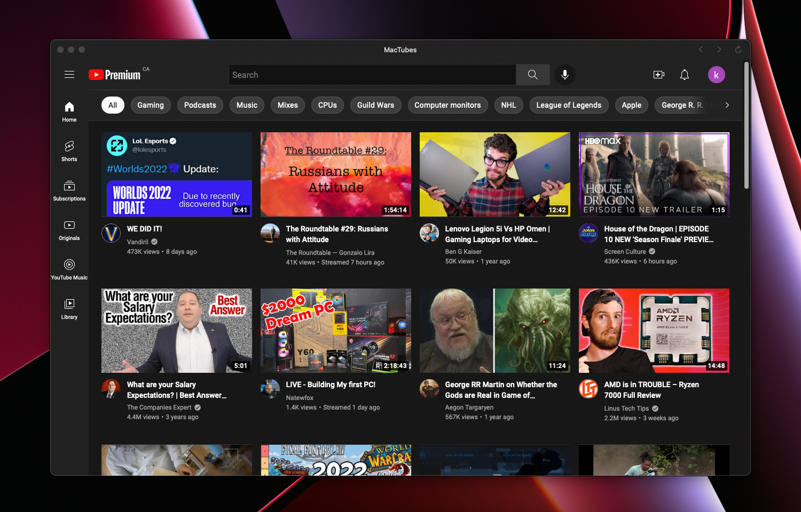

# MacTubes

A simple YouTube app for macOS.

## About

I created MacTubes so I could have a standalone PWA-style YouTube app without having to use Chrome.

## Download

[Download MacTubes](https://github.com/kjoedion/mactubes/releases/download/1.0/MacTubes.app.zip)

## Warning

You may get a warning when first opening this app. This is because I have not enrolled in the Apple Developer Program.

After getting this warning, go to Settings -> Security & Privacy -> at the bottom of the General tab, click "Open Anyway".

## MacTunes

Looking for a YouTube Music app as well? Check out [MacTunes](https://github.com/kjoedion/mactunes).
